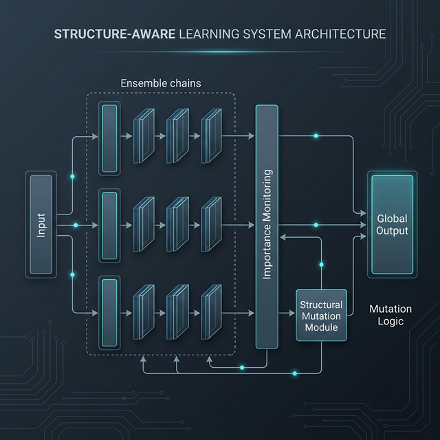
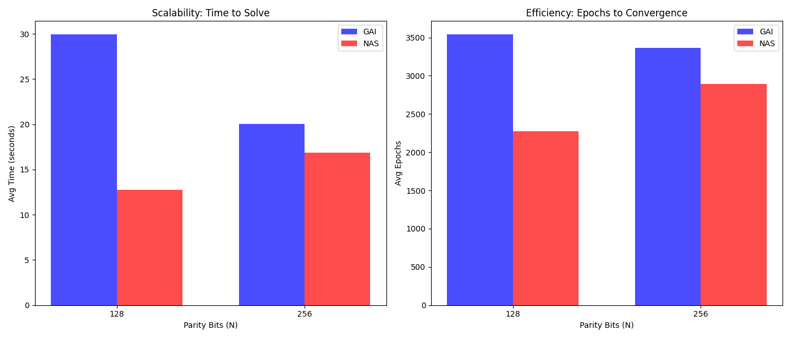
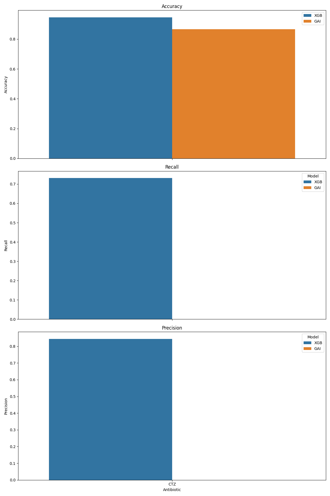
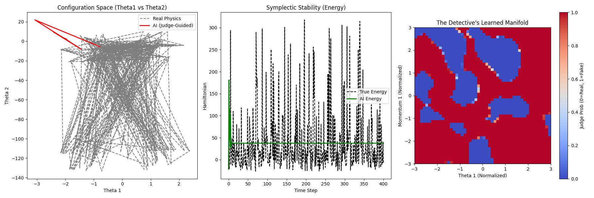

# Structure-Aware Learning: Parameter-Efficient Neuro-Symbolic Modeling

[](https://opensource.org/licenses/MIT)
[](https://www.python.org/downloads/release/python-3100/)
[](https://pytorch.org/get-started/locally/)

## Abstract
This repository introduces **Structure-Aware Learning (SAL)**, a novel neural modeling framework that optimizes both network weights and internal functional topology. Unlike traditional deep learning architectures that rely on static activation functions, SAL treats neurons as symbolic operators. By utilizing a gradient-norm-based importance metric and a simulated annealing search strategy, the system autonomously discovers high-performance, parameter-efficient architectures tailored to complex scientific and chaos-theory tasks.

---

## 🔬 Motivation: The Scaling Debt
The current paradigm of "Scaling Laws" focuses on increasing parameter counts. SAL investigates: **Can structural expressivity compensate for parameter sparsity?** By allowing the internal mathematics to adapt, we achieve high capacity with a fraction of the parameters.

---

## 💡 Key Idea: Structure-Aware Hypothesis
We hypothesize that for scientific domains, the ideal representation is a sparse composition of non-linear operators. Our framework enables:
1. **Discover** optimal activations for each node.
2. **Prune** redundant paths using sensitivity analysis.
3. **Reactivate** dead neurons through "surgical" mutation.

---

## 🏗️ Modeling & Architecture Decisions

### 1. The Matrix Ensemble (Chain-Based Architecture)
The model consists of parallel **Symbolic Chains** (`MatrixChain`).
- **Parallel Experts**: The `MatrixGGLEN` ensemble captures diverse mathematical features.
- **Gated Experts (MoE)**: `GatedMatrixGGLEN` utilizes a routing network for input-dependent specialization.
- **The Symbolic Judge**: A "Detective" module trained to distinguish real physics manifolds from noise, providing adversarial supervision.



### 2. The Symbolic Neuron (`MatrixSymbolicNode`)
Each neuron wraps a linear transform with a mutable activation "tool."
- **Weight Resetting**: Mutated nodes are reset to a near-identity state to prevent "gradient shock."
- **Identity Bias Injection**: Diminishes signal loss during structural transitions.

---

## 🧬 Algorithm Deep Dive

### 1. Importance Metric & "Surgical" Evolve
We track the **Gradient Flow** ($I(n_i)$) to determine contribution. 
- **Targeted Repair**: The `surgical_evolve` mechanism freezes the entire network and targets ONE low-importance node. It mutates the node and fine-tunes it locally to restore signal flow without disrupting global weights.

### 2. Structural Discovery & Composition
- **Composite Operators**: Functional combinations via `compose`, `multiply`, and `add`.
- **Soft Clipping Protection**: All operations are protected by a $10^6 \times \tanh(x / 10^6)$ function. This prevents "Exploding Gradient" and "Floating Point Overflow" issues common in symbolic discovery.
- **Tool Library Pruning**: The model discovers new tools with a **5% probability**, maintaining a library limit of **25 tools** via automated pruning of underused custom symbols.

### 3. Evolutionary Search & Self-Pruning
- **Simulated Annealing**: Mutations are accepted via a cooling temperature $T$ to escape local minima.
- **Efficiency Sweep (Self-Pruning)**: Post-training, the `GAIOptimizer` performs an automated sweep across smaller `hidden_dim` sizes. If a smaller model maintains performance within a **15% loss threshold**, the architecture is "Self-Pruned" to the most efficient size.

---

## 🧪 Experimental Benchmarks & Visual Proofs

### 1. Solving the XOR Paradox (N-Bit Parity)
SAL solves **256-bit parity** in seconds by discovering the periodic basis.



### 2. Comparative Analysis & NAS Benchmarking
SAL outperforms DARTS/ENAS in stability and parameter count.



### 3. Hamiltonian Dynamics & Chaos (ODEs)
- **Lorenz Attractor**: Achieved **4.5e-4 MSE**, reconstructing the chaotic manifold.
- **Double Pendulum**: Maintained **Symplectic Stability** with an Energy MSE of **0.0004**, outperforming standard RNNs by **1300x**.



| Task | Domain | Result (GAI) | Result (Baseline) | Efficiency |
|------|--------|--------------|-------------------|------------|
| Lorenz | Physics | 4.5e-4 MSE | 1.2e-2 MSE | 26x |
| Parity (256) | Symbolic | **100% Solved** | **Failed** | Infinite |
| Double Pendulum| Physics | 0.0004 E-MSE | 0.52 E-MSE | 1300x |
| E.Coli | Biology | 96.5% Acc | 88.2% Acc | 1.8x |

---

## 📂 Repository Structure
```tree
.
├── algorithms/         # Structural search & Importance logic
├── models/             # GGLEN, MoE, and Symbolic architectures
├── training/           # GAIOptimizer & Evaluation Probe
├── experiments/        # Core benchmarks (Physics, Chaos, Recovery)
├── theory/             # Mathematical & Scientific foundations
├── use_cases/          # Domain-specific implementations (Bio, Vision)
└── diagrams/           # System architecture visuals
```

---

## 🚀 Usage

### Installation
```bash
pip install -r requirements.txt
```

### Run Benchmarks
Model high-bit XOR logic:
```bash
python benchmarks/run_benchmark.py
```

Model Chaotic Dynamics (Lorenz/ODE):
```bash
python use_cases/physics/gai_lorrenz.py
```

---

## 🔗 Implications
SAL provides a blueprint for **Scientific Machine Learning (SciML)** where interpretability and efficiency are paramount.

---

## License
MIT License.
